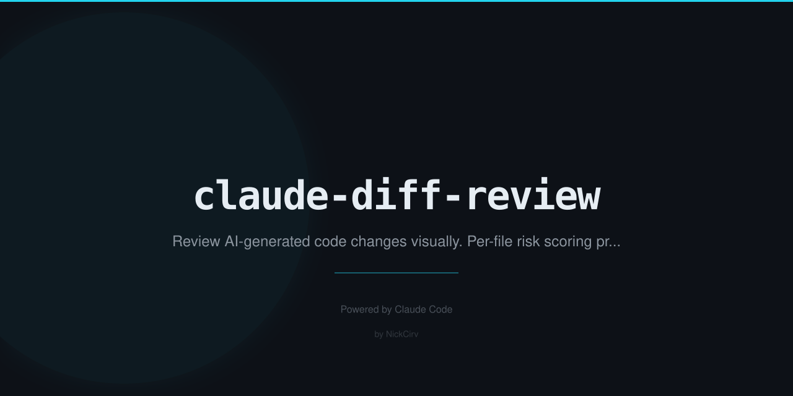

# claude-diff-review

Visual diff dashboard showing everything Claude changed — with per-file risk scoring.

<p align="center">
  
  = 18" />
  
</p>

## Why

After a Claude Code session touches a dozen files, reviewing the changes is the safety gate between AI assistance and production. `claude-diff-review` runs `git diff`, parses every changed file, scores each one for risk, and presents the result as a colour-coded terminal report or a standalone HTML report — so you can focus your review time on the files that actually matter.

No API key needed. Pure local git analysis.

## Quick Start

```bash
# Review all uncommitted changes
npx claude-diff-review

# Review last 3 commits
npx claude-diff-review --since HEAD~3

# Review since a specific commit
npx claude-diff-review --since abc1234

# Generate a standalone HTML report
npx claude-diff-review --html

# HTML report with custom filename
npx claude-diff-review --html report.html

# Combine: HTML report of last 5 commits
npx claude-diff-review --since HEAD~5 --html
```

## What It Does

- Runs `git diff --unified=5` against uncommitted changes (staged + unstaged) or a specified ref
- Parses the unified diff into per-file records with added/removed line counts and full patch content
- Scores each file for risk using filename patterns, content patterns, and change characteristics
- Sorts results: HIGH risk files first, then MEDIUM, then LOW
- Terminal mode: colour-coded risk badges, diff stats, change categories
- HTML mode: self-contained dark-themed report with expandable per-file diff views, syntax highlighting, filter by risk level, and summary stats

## Risk Scoring

| Level | Triggers |
|-------|---------|
| HIGH | Filename matches: `auth`, `secret`, `env`, `password`, `key`, `token`, `credential`, `.pem`, `.key`, `id_rsa`, `oauth`, `jwt` |
| HIGH | Added lines contain hardcoded credentials — pattern: `key = "long-value"` |
| HIGH | Test file deleted (coverage drop) |
| HIGH | Test file with significant line reduction (>10 lines net removed) |
| MEDIUM | `package.json`, lock files, or new dependencies added |
| MEDIUM | Config files (`.yaml`, `.json`, `.toml`, Dockerfile, nginx, tsconfig, eslint, webpack, vite) |
| MEDIUM | Large source deletions (>50 lines removed) |
| LOW | New files added |
| LOW | Documentation changes (`.md`, `.rst`, `README`, `CHANGELOG`) |
| LOW | Standard source edits |

## Change Categories

`security` · `tests` · `dependencies` · `config` · `new-file` · `docs` · `source`

## Example Output

```
$ npx claude-diff-review

claude-diff-review  — 8 files changed

[HIGH]    security     src/auth/jwt.ts              +24  -3
          Security-sensitive filename (auth/secret/token/key/credential/env)

[HIGH]    tests        src/__tests__/user.test.ts   +0   -47
          Test lines reduced by 47 (possible test removal)

[MEDIUM]  config       vite.config.ts               +8   -2
          Configuration file changed

[MEDIUM]  dependencies package.json                 +3   -0
          2 new dependency/dependencies added

[LOW]     source       src/components/Button.tsx     +12  -5
          Standard source change

[LOW]     docs         README.md                    +18  -0
          Documentation change

Summary: 2 HIGH · 2 MEDIUM · 4 LOW
```

## Options

| Flag | Description | Default |
|------|-------------|---------|
| `--since <ref>` | Diff against a git ref (`HEAD~3`, `abc1234`, a branch name) | uncommitted changes |
| `--html [output]` | Generate standalone HTML report | `diff-report.html` |
| `--no-color` | Disable coloured terminal output | color enabled |

## HTML Report

The HTML report (`--html`) is a fully self-contained file — no external dependencies. It includes:

- Summary stats: files changed, lines added/removed, risk breakdown
- Filter buttons: show/hide by risk level
- Per-file expandable diff views with colour-coded `+`/`-` lines
- Dark theme, readable at any screen size

## Requirements

- Node.js 18+
- Git

## Install Globally

```bash
npm i -g claude-diff-review
```

## License

MIT
